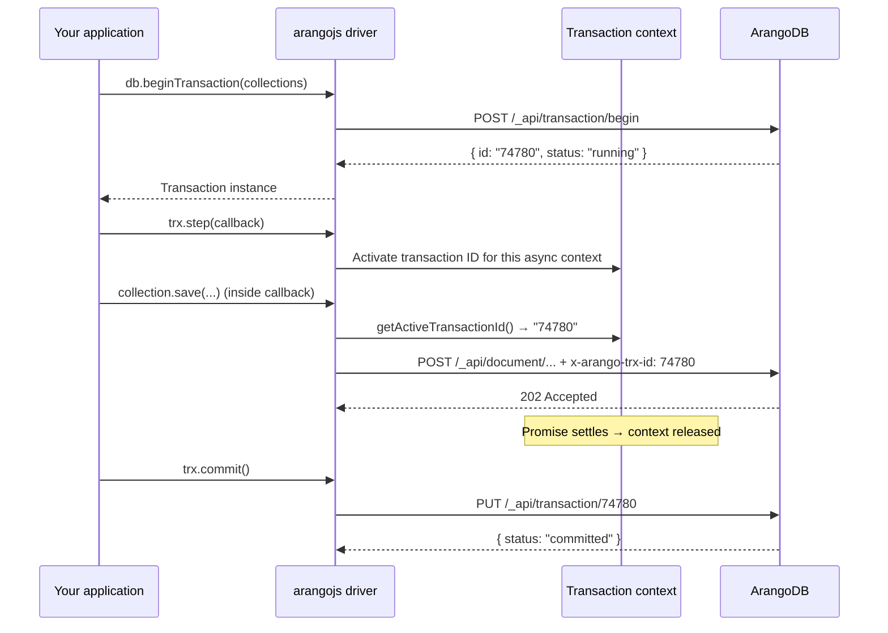
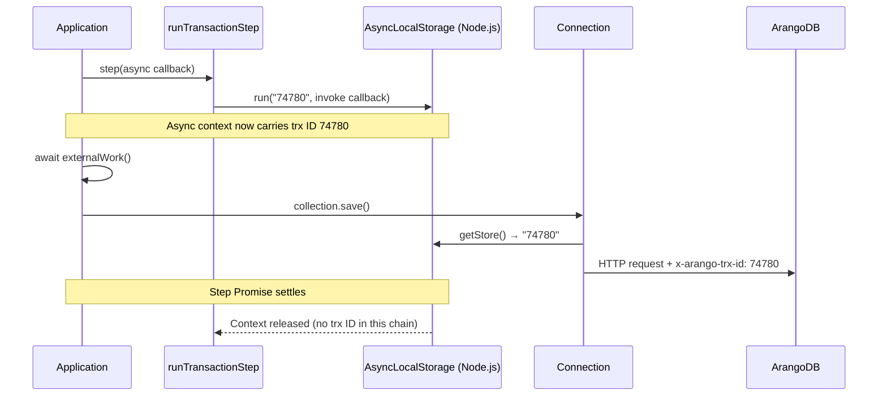
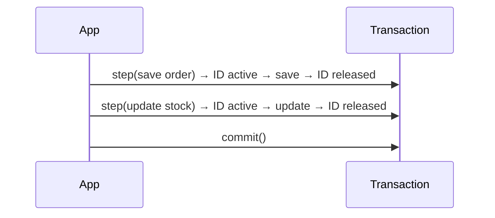
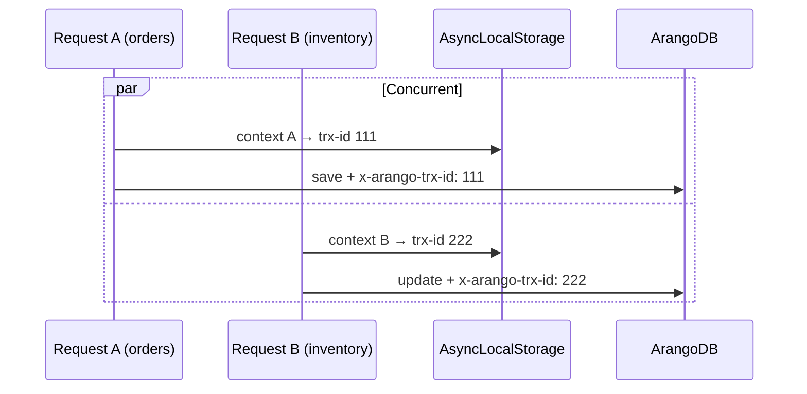

# Stream transactions in arangojs

This guide explains how **stream transactions** work in the arangojs JavaScript driver after the DE-10 fix. It is written for developers integrating arangojs and for anyone who needs a clear picture of what changed and how to use transactions safely.

**Related Jira:** DE-10 — Review Stream Transactions in JavaScript driver.

---

## Table of contents

1. [What is a stream transaction?](#1-what-is-a-stream-transaction-plain-language)
2. [Quick start](#2-quick-start)
3. [What changed — old vs new](#3-what-changed--old-vs-new)
4. [How it works under the hood](#4-how-it-works-under-the-hood)
5. [Usage patterns and examples](#5-usage-patterns-and-examples)
6. [Concurrent requests and mixed workloads](#6-concurrent-requests-and-mixed-workloads)
7. [Node.js vs browser](#7-nodejs-vs-browser)
8. [Cluster and server limits](#8-cluster-and-server-limits)
9. [API reference (summary)](#9-api-reference-summary)
10. [Migration from the old behaviour](#10-migration-from-the-old-behaviour)
11. [Troubleshooting](#11-troubleshooting)
12. [Further reading](#12-further-reading)

---

## 1. What is a stream transaction?

A **transaction** groups several database changes into one unit: either **all** changes are applied together, or **none** of them are (on abort / error).

**Stream transactions** are ArangoDB’s way of doing this across **multiple HTTP requests**:

1. You **begin** a transaction on the server → you get a transaction ID.
2. Each database operation you want inside the transaction is sent with that ID (HTTP header `x-arango-trx-id`).
3. You **commit** (apply everything) or **abort** (roll back everything).

In arangojs you do not set that header yourself. You wrap operations in `trx.step(...)` (or use `db.withTransaction(...)`), and the driver attaches the header for you.

**Analogy:** Think of a transaction as a shopping cart. Items you add while the cart is open belong to the same purchase. Commit = checkout. Abort = empty the cart. The driver’s job is to make sure every “item” (DB call) you intend for the cart actually goes into the right cart — even when your code uses `async/await` or runs in parallel with other requests.

---

## 2. Quick start

### Manual transaction (begin → steps → commit)

```js
import { Database } from "arangojs";

const db = new Database({ url: "http://localhost:8529" });
const collection = db.collection("orders");

const trx = await db.beginTransaction(collection);

try {
  await trx.step(() => collection.save({ _key: "order-1", total: 100 }));
  await trx.step(() => collection.save({ _key: "order-2", total: 200 }));
  await trx.commit();
} catch (err) {
  await trx.abort().catch(() => {});
  throw err;
}
```

### Recommended helper (auto commit / abort)

```js
await db.withTransaction(collection, async (step) => {
  await step(() => collection.save({ _key: "order-1", total: 100 }));
  await step(() => collection.save({ _key: "order-2", total: 200 }));
});
// Commits on success; aborts if the callback throws.
```

### Async work inside one step

```js
await trx.step(async () => {
  await validateWithExternalApi(data);   // non-DB async work is fine
  await collection.save(data);           // this save is part of the transaction
});
```

---

## 3. What changed — old vs new

### Summary for everyone

| Topic | Before (old driver) | After (current driver) |
|-------|---------------------|-------------------------|
| **`await` before a DB call inside `trx.step`** | DB call often ran **outside** the transaction | DB call runs **inside** the transaction |
| **`trx.abort()` after async step** | Might **not** roll back async work | Rolls back async work correctly |
| **Multiple saves in one async step** | Only the first sync part was in the transaction | All saves in the step are in the transaction |
| **Two transactions at once on one `Database` (Node.js)** | Unreliable (shared connection ID) | **Supported** via AsyncLocalStorage |
| **Non-transactional request while a transaction runs (Node.js)** | Could accidentally share ID in edge cases | **No header** — isolated async context |
| **Where transaction ID lived** | One global field on the connection | Per async context (Node) or step-scoped slot (browser) |
| **Public API** | `beginTransaction`, `step`, `commit`, `abort`, `withTransaction` | **Unchanged** — same methods |

### Technical comparison

| Aspect | Old behaviour | New behaviour |
|--------|---------------|---------------|
| **When transaction ID was cleared** | Immediately when `step()` callback **returned** (sync `finally`) | When the callback’s **Promise settles** (Node: AsyncLocalStorage; browser: `.finally()`) |
| **Async callback** | Context lost at first `await` | Context kept for full Promise lifetime |
| **`.then()` delay** | e.g. `sleep(500).then(() => save())` ran outside trx | Delayed save still inside trx |
| **Concurrent `trx1.step` + `trx2.step` on same `db`** | Second could overwrite first’s ID | Each async context has its own ID (Node.js) |
| **Internal API** | `Connection#setTransactionId` / `#clearTransactionId` | Removed — use async context only |

### Example: the original bug

**Old (broken):**

```js
await trx.step(async () => {
  await someAsyncWork();              // driver cleared transaction ID here
  return collection.save({ _key: "x" }); // sent WITHOUT x-arango-trx-id
});
await trx.abort(); // save was NOT rolled back — data could remain
```

**New (fixed):**

```js
await trx.step(async () => {
  await someAsyncWork();              // transaction ID still active
  return collection.save({ _key: "x" }); // sent WITH x-arango-trx-id
});
await trx.abort(); // save IS rolled back
```

---

## 4. How it works under the hood

### 4.1 High-level flow



### 4.2 What happens inside `trx.step()`



**Key rule:** The HTTP header is added only when `Connection#request()` runs **and** the current async context has an active transaction ID. That ID is set only while you are inside `trx.step()` (or `withTransaction`’s `step` function).

### 4.3 Node.js: AsyncLocalStorage

On Node.js (20, 22, 24 LTS and later), the driver uses [AsyncLocalStorage](https://nodejs.org/api/async_context.html#class-asynclocalstorage) from `node:async_hooks`:

- Each **async execution context** (e.g. one HTTP request handler) can have its **own** transaction ID.
- The ID propagates through `await`, `.then()`, and related Promise chains.
- When the Promise returned from `step()` settles, that context no longer carries the ID.
- Code that **never** entered `trx.step()` sees **no** transaction ID → requests go out without `x-arango-trx-id`.

Implementation lives in `src/lib/transaction-context.ts`; `src/connection.ts` reads the ID at request time.

### 4.4 Browser fallback

Browsers do not provide AsyncLocalStorage. The driver uses a **single module-level slot** that is held until the step Promise settles. That fixes async-inside-step but does **not** safely support multiple concurrent transactions on one `Database`. Use separate `Database` instances for concurrent work in the browser.

---

## 5. Usage patterns and examples

### 5.1 Sequential steps (most common)

One operation per step, awaited in order:

```js
const trx = await db.beginTransaction({ write: ["orders", "inventory"] });
const orders = db.collection("orders");
const inventory = db.collection("inventory");

await trx.step(() => orders.save({ _key: "o1", sku: "A" }));
await trx.step(() => inventory.update("A", { stock: 9 }));
await trx.commit();
```



### 5.2 Multiple DB calls in one step

```js
await trx.step(async () => {
  const left = await vertices.save({ label: "left" });
  const right = await vertices.save({ label: "right" });
  return edges.save({ _from: left._id, _to: right._id });
});
await trx.commit();
```

All three writes share the same transaction ID until the step Promise completes.

### 5.3 Delayed work with `.then()`

```js
const delay = (ms) => new Promise((r) => setTimeout(r, ms));

await trx.step(() =>
  delay(500).then(() => collection.save({ _key: "delayed" }))
);
// Save runs 500 ms later but still inside the transaction.
```

### 5.4 `withTransaction` (recommended)

```js
const result = await db.withTransaction(
  { write: ["vertices", "edges"] },
  async (step) => {
    const start = await step(() => vertices.document("a"));
    const end = await step(() => vertices.document("b"));
    return step(() => edges.save({ _from: start._id, _to: end._id }));
  }
);
// Returns the edge metadata; commits automatically.
```

On error, the driver attempts `trx.abort()` before rethrowing.

### 5.5 Passing work to helper functions

Helpers should receive `trx` or `step` and wrap each DB call:

```js
async function saveOrder(step, order) {
  await step(() => orders.save(order));
  await step(() => inventory.update(order.sku, { reserved: true }));
}

const trx = await db.beginTransaction({ write: ["orders", "inventory"] });
try {
  await saveOrder(trx.step.bind(trx), { _key: "o1", sku: "A" });
  await trx.commit();
} catch (e) {
  await trx.abort().catch(() => {});
  throw e;
}
```

Or with `withTransaction`:

```js
await db.withTransaction({ write: ["orders", "inventory"] }, async (step) => {
  await saveOrder(step, { _key: "o1", sku: "A" });
});
```

### 5.6 What **not** to do

```js
// WRONG: pass a promise instead of a callback
await trx.step(collection.save(data));

// WRONG: forget to return the promise from an async callback
await trx.step(async () => {
  collection.save(data); // missing return/await — may not wait correctly
});

// WRONG: commit before step finishes
trx.step(() => collection.save(data)); // not awaited
await trx.commit(); // step may still be running
```

**Always:** `await trx.step(() => ...)` and await commit/abort after all steps complete.

---

## 6. Concurrent requests and mixed workloads

### 6.1 Two transactional handlers on one `Database` (Node.js)

```js
const db = new Database(config); // shared across the app

app.post("/orders", async (req, res) => {
  await db.withTransaction("orders", async (step) => {
    await step(() => db.collection("orders").save(req.body));
  });
  res.json({ ok: true });
});

app.post("/inventory", async (req, res) => {
  await db.withTransaction("inventory", async (step) => {
    await step(() => db.collection("inventory").update(req.body._key, req.body));
  });
  res.json({ ok: true });
});
```

If both endpoints are hit at the same time, each request runs in its **own** async context with its **own** transaction ID. They do not interfere on Node.js.



### 6.2 Transactional write + non-transactional update at the same time

```js
async function writeWithTransaction(doc) {
  const trx = await db.beginTransaction(collection);
  await trx.step(() => collection.save(doc));
  await trx.commit();
}

async function updateWithoutTransaction(doc) {
  await collection.update(doc._key, doc); // NOT inside trx.step
}

await Promise.all([
  writeWithTransaction(doc1),
  updateWithoutTransaction(doc2),
]);
```

| Call | Inside `trx.step`? | `x-arango-trx-id` on request? |
|------|-------------------|-------------------------------|
| `writeWithTransaction` → `save` | Yes | **Yes** |
| `updateWithoutTransaction` → `update` | No | **No** |

The update is a normal, immediate write — not part of any transaction.

**Caution:** If you call `updateWithoutTransaction` **from inside** a `trx.step` callback, it **will** inherit the transaction ID because it runs in the same async context. Keep non-transactional calls outside `step` if you want them committed independently.

### 6.3 Two stream transactions in parallel (explicit)

```js
const trx1 = await db.beginTransaction(collection);
const trx2 = await db.beginTransaction(collection);

await Promise.all([
  trx1.step(() => collection.save({ _key: "a" })),
  trx2.step(() => collection.save({ _key: "b" })),
]);

await trx1.commit();
await trx2.commit();
```

Supported on **Node.js**. In the **browser**, use separate `Database` instances instead of parallel transactions on one instance.

---

## 7. Node.js vs browser

| Capability | Node.js 20+ (incl. 22 & 24 LTS) | Browser |
|------------|----------------------------------|---------|
| Async work inside `trx.step` | Yes | Yes |
| Multiple DB calls in one step | Yes | Yes |
| `trx.abort()` rolls back async steps | Yes | Yes |
| Concurrent transactions on one `Database` | **Yes** (AsyncLocalStorage) | **No** — use separate `Database` instances |
| Concurrent trx + non-trx on one `Database` | Isolated contexts | Risk of cross-talk — prefer separate instances |
| Mechanism | `AsyncLocalStorage` per async context | Single slot until step Promise settles |

---

## 8. Cluster and server limits

Stream transaction behaviour on the **server** is unchanged. The driver fix is client-side only.

| Topic | Notes |
|-------|--------|
| **Idle timeout** | See [Idle timeout between operations](#81-idle-timeout-between-operations) below. |
| **Cluster** | Multi-document ACID has cluster limitations; see [ArangoDB transaction docs](https://docs.arango.ai/arangodb/stable/develop/transactions/). |
| **`poolSize`** | In cluster with load balancing, you may need a higher `config.poolSize` for many parallel transactions. See README “Streaming transactions timeout in cluster”. |
| **ArangoDB 4.0** | JavaScript transactions (`executeTransaction`) removed; **stream transactions** are the supported multi-step API. |
| **Begin options** | `skipFastLockRound`, `maxTransactionSize`, `lockTimeout`, `allowImplicit`, `waitForSync` — passed to `beginTransaction` / `withTransaction`. |

### 8.1 Idle timeout between operations

ArangoDB enforces a **maximum idle time** between operations in a single stream transaction (on coordinators and single servers). This prevents abandoned transactions from holding locks indefinitely.

| Setting | Value |
|---------|--------|
| **Default** | **60 seconds** between operations |
| **Maximum (configurable)** | **Up to 120 seconds** via the server startup option `--transaction.streaming-idle-timeout` |
| **Reset behaviour** | Each operation sent while the transaction is still valid **resets** the idle timer to the configured timeout |

**Plain language:** If you begin a transaction and then wait too long before the next `trx.step()` (or commit/abort), the server may expire the transaction. The clock resets every time you perform an operation inside that transaction.

**Example:** With the default 60 s timeout, a gap of 90 s between two steps can fail with `transaction not found` or similar. An administrator can raise the limit to at most 120 s on the server; the driver cannot change this — it is enforced by ArangoDB.

Official reference: [Stream Transactions — timeout and transaction size](https://docs.arango.ai/arangodb/stable/develop/transactions/stream-transactions/) and [Transaction limitations](https://docs.arango.ai/arangodb/stable/develop/transactions/limitations/).

---

## 9. API reference (summary)

| Method | Description |
|--------|-------------|
| `db.beginTransaction(collections, options?)` | Starts a stream transaction; returns `Transaction`. |
| `trx.step(callback)` | Runs `callback` in transaction context; callback must return a Promise. |
| `trx.commit(options?)` | Commits the transaction. |
| `trx.abort(options?)` | Aborts and rolls back. |
| `trx.get()` | Returns `{ id, status }`. |
| `db.withTransaction(collections, callback, options?)` | Begin + run callback with `step` + commit; abort on throw. |
| `db.transaction(id)` | Returns a `Transaction` handle for an existing server-side ID. |
| `db.listTransactions()` | Lists running stream transactions for this database. |

**Collection options** for `beginTransaction`:

```js
await db.beginTransaction({
  read: ["readonly_col"],
  write: ["orders", "inventory"],
  exclusive: ["locked_col"], // optional exclusive lock
});
```

Or pass a single collection / array of collections as shorthand for `{ write: [...] }`.

---

## 10. Migration from the old behaviour

### If you followed old “one DB call per step” guidance

That pattern still works and remains a good style for clarity. You are **not** required to merge steps — you **may** now use async/multi-call steps when it simplifies your code.

### If you worked around the async bug

Patterns like splitting every `await` into its own `trx.step` or moving async logic **outside** `step` were compensating for the old leak. You can simplify:

```js
// Old workaround
await loadData();
await trx.step(() => collection.save(data));

// New — optional simplification
await trx.step(async () => {
  await loadData();
  return collection.save(data);
});
```

### If you relied on concurrent transactions on one `Database` (Node.js)

Previously unreliable; now supported. No code change required if you already structured steps correctly — behaviour becomes correct instead of racy.

### Internal / advanced integrations

If you called `Connection#setTransactionId` or `#clearTransactionId` directly (internal API), those methods are **removed**. Use public `trx.step()` only.

---

## 11. Troubleshooting

| Symptom | Likely cause | What to do |
|---------|--------------|------------|
| `abort()` did not roll back changes | Old driver version, or DB call **outside** `trx.step` | Upgrade; wrap every transactional call in `step`; await all steps before abort |
| `transaction not found` / `expired` | Idle timeout between steps exceeded (default **60 s**, max configurable **120 s** on server) | Keep steps within the idle window; ask ops to set `--transaction.streaming-idle-timeout` (≤ 120 s); check cluster coordinator stickiness |
| Non-transactional update appears transactional | Update called **inside** `trx.step` callback | Move non-transactional calls outside `step` |
| Concurrent transactions interfere (browser) | Browser single-slot fallback | Use one `Database` per concurrent transaction |
| `Transaction callback was not an async function...` | `step()` callback did not return a Promise | Use `() => collection.save(...)` or an `async` function |
| Changes visible before commit | Reading **outside** the transaction | Reads without trx ID see committed data only; use `step` for reads that must see uncommitted trx data |

---

## 12. Further reading

- [Stream Transactions — ArangoDB HTTP API](https://docs.arango.ai/arangodb/stable/develop/http-api/transactions/stream-transactions/)
- [Stream Transactions — ArangoDB developer guide](https://docs.arango.ai/arangodb/stable/develop/transactions/stream-transactions/)
- [Node.js AsyncLocalStorage](https://nodejs.org/api/async_context.html#class-asynclocalstorage)
- [ArangoDB 4.0 removed methods](./arangodb-v4-removed-methods.md) — `executeTransaction` removed; use stream transactions
- Generated API docs: [`Transaction#step`](https://arangodb.github.io/arangojs/latest/classes/transaction.Transaction.html#step), [`Database#withTransaction`](https://arangodb.github.io/arangojs/latest/classes/database.Database.html#withTransaction)

---

## Glossary

| Term | Meaning |
|------|---------|
| **Stream transaction** | Multi-step transaction: begin on server, attach ID to each operation, then commit or abort. |
| **`x-arango-trx-id`** | HTTP header that tells ArangoDB which transaction an operation belongs to. |
| **`trx.step(callback)`** | Driver API that runs `callback` while the transaction ID is active for that async context. |
| **AsyncLocalStorage** | Node.js feature that stores data per async context (used to isolate concurrent transactions). |
| **Idle timeout** | Maximum time with no operations before the server expires a stream transaction. Default **60 s**; configurable up to **120 s** (`--transaction.streaming-idle-timeout`). |
| **Commit** | Apply all transaction changes permanently. |
| **Abort** | Discard all transaction changes. |
